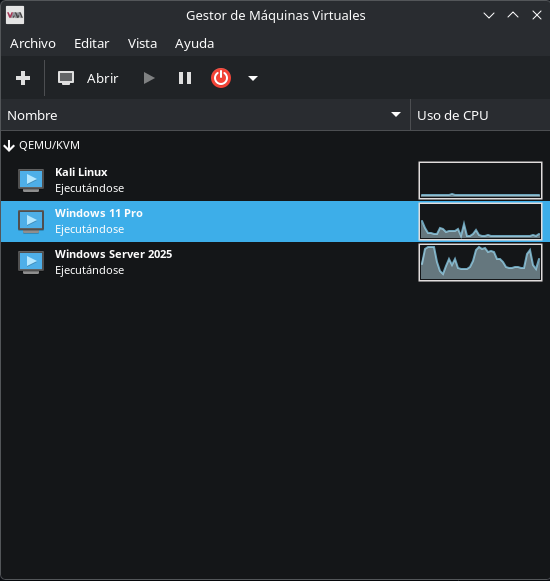
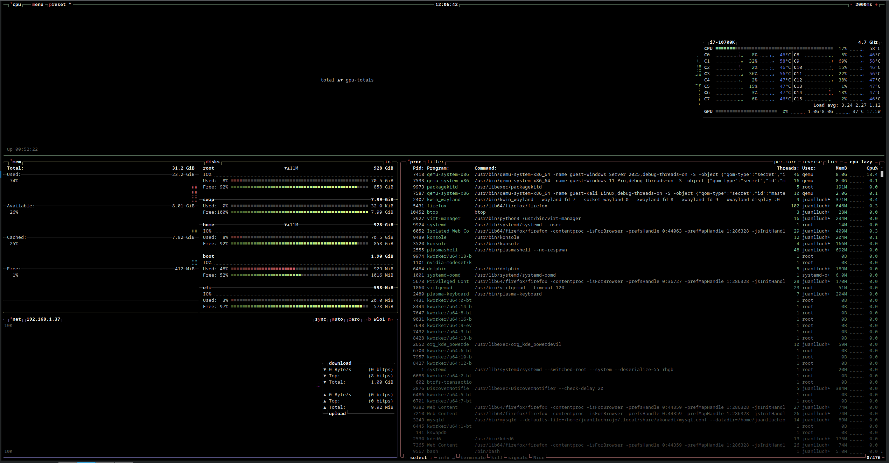
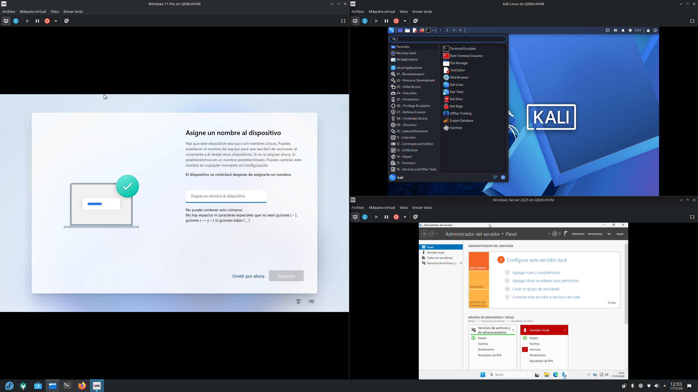
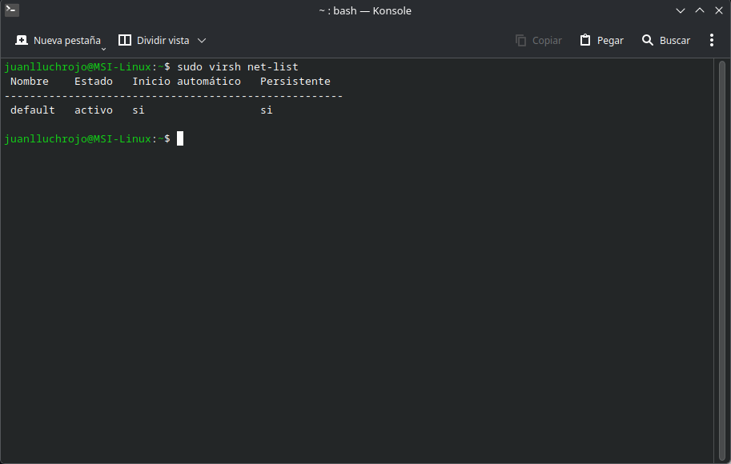

# Homelab - Virtualized Infrastructure Lab
## Overview

This project consists of a personal Homelab environment built using Linux virtualization technologies with the objective of learning, testing and documenting real-world IT infrastructure scenarios.

The lab is designed to simulate enterprise environments focused on:

 - System Administration
 - Virtualization
 - Networking
 - Windows & Linux environments
 - Infrastructure services
 - Cybersecurity
 - Troubleshooting
 - Automation
 - SQL and NoSQL Servers and communications with hosts

---

# Objectives

## Main Goals

 - Learn Virtualization technologies in Linux
 - Deploy isolated virtual infrastructures
 - Practice Windows and Linux administration
 - Understand enterprise networking concepts
 - Improve troubleshooting skills
 - Document technical configurations and architectures

## Future Goals

 - Active Directory deployment
 - DNS & DHCP services
 - Docker / Podman containers
 - Infrastructure automation
 - SIEM and monitoring tools
 - Security hardening
 - VLANs and advanced networking
 - Cloud and hybrid environments

---

# Host System

| Component | Technology |
|---|---|
| Operating System | Fedora Linux |
| Kernel | Latest Linux Kernel |
| Filesystem | BTRFS |
| Virtualization | KVM/QEMU |
| Management Tool | Virt-Manager |
| Virtual Network | libvirt NAT |

---

# Network Architecture

```
Internet
   |
   |
   |
Router
   |
   |
   |
Fedora Host
   |
   |
   |
KVM / Libvirt
   |
   |
   |
virbr0 (NAT)
   |
   |--- Windows Server 2025 VM
   |
   |--- Windows 11 Pro VM
   |
   |--- Kali Linux VM
```
---

# Virtualization Stack

This Homelab uses:

 - KVM
 - QEMU
 - libvirt
 - Virt-Manager

The environment is configured using NAT networking throug virbr0, allowing:

 - Internet access for VMs
 - Internal communication between VMs
 - Isolation from the physical network
 - Simplified deployment and management


---

# Virtual Machines

| VM Name | Operating System | Purpose |
|---|---|---|
| DC01 | Windows Server 2025 | Active Directory / Infrastructure |
| CLIENT01 | Windows 11 Pro | Client Testing |
| Kali Linux | Kali Linux | Hardening and Security research |

---

# Project Structure
```
homelab/
|
|--- README.md
|
|--- docs/
|
|--- diagrams/
|
|--- screenshots/
|
|--- scripts/
|
|--- configurations/
```
---

# Screenshots






---

# Installation

## Install Virtualization Packages

```bash
sudo dnf install @virtualization
```

## Download Official ISOs

```Kali Linux
https://www.kali.org/get-kali/#kali-virtual-machines
```
```Windows 11 Pro
https://www.microsoft.com/es-es/software-download/windows11
```
```Windows Server 2025 Evaluation Copy
https://www.microsoft.com/es-es/evalcenter/evaluate-windows-server-2025
```
---
# Security & Snapshots

This environment uses BTRFS snapshots for rollback and recovery purposes.

Snapshot management tools:

 - Snapper
 - BTRFS Assistant

Benefits:

 - Safe updates
 - Easy Rollback
 - System recovery
 - Testing without risk

---

# Technologies & Concepts

## Linux

 - Fedora Linux
 - SELinux
 - Systemd
 - BTRFS
 - Networking

## Virtualization

 - KVM
 - QEMU
 - libvirt

## Windows

 - Windows Server
 - Active Directory
 - Group Policies

## Networking

 - NAT
 - DHCP
 - DNS
 - Virtual Switching

---

# Motivation

This Homelab was created as a practical learning environment to gain hands-on experience
with technologies commonly used in professional IT infrastructures.

The project focuses on:
 
 - Practical learning
 - Documentation
 - Experimentation
 - Infrastructure design
 - Continuous improvement

---

# What I learned

 - Linux virtualization with KVM/QEMU
 - Virtual networking with libvirt
 - Git and GitHub workflow
 - Infrastructure documentation
 - Snapshot management with BTRFS
 - Virtual machine administration

---

# Status

## In Development

This homelab is continuously evolving with new services, configurations and infrastructure components.

---

# Author

Personal Homelab project focused on Systems Administration, Infrastructure and Cybersecurity Learning.
